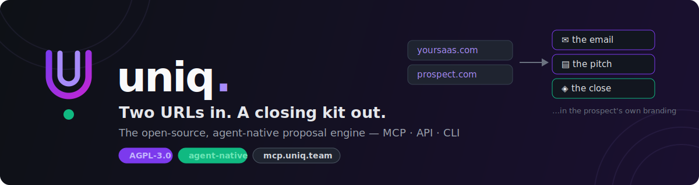

<p align="center">
  <a href="https://uniq.team">
    
  </a>
</p>

<p align="center">
  <a href="https://opensource.org/licenses/AGPL-3.0"></a>
  <a href="https://uniq.team/api/mcp"></a>
  <a href="https://www.npmjs.com/package/@getuniq/cli"></a>
  <a href="https://uniq.team/llms.txt"></a>
  <a href="https://uniq.team/openapi.yaml"></a>
</p>

<p align="center">
  <b>🤖 Agent-native from day one:</b> works inside <b>Claude Code · Claude · Cursor · Clay · n8n · Make · Zapier</b> — one MCP link or one HTTP call.
</p>

<h3 align="center">Two URLs in. A closing kit out.</h3>

<p align="center">
Give Uniq your website and your prospect's website. It returns a <b>proof-of-work cold email</b>, an <b>HTML pitch page</b>, and a <b>hosted proposal wearing the prospect's own brand</b> — their colors, their type, their logo — while the sign-off keeps <i>your</i> voice.<br/>
An alternative to: GenPage, Flint, Sendr, Qwilr templates — but open source and built for agents.
</p>

<p align="center">
  <a href="https://uniq.team">Website</a> ·
  <a href="https://uniq.team/start">Start free (5 kits)</a> ·
  <a href="https://uniq.team/install">Install</a> ·
  <a href="https://uniq.team/integrations">Integrations</a> ·
  <a href="https://uniq.team/pricing">Pricing</a> ·
  <a href="https://uniq.team/llms.txt">Agent docs</a>
</p>

---

## See it, don't believe it

We ran the GTM stack's own tools through Uniq — each one "pitching" a company from its own orbit. **Real generations, untouched**, each page in the *prospect's* brand with the *seller's* sign-off:

| What if… | The email Uniq opened with | Live page |
|---|---|---|
| **Clay** pitched **Ramp** | "the CFO-switch signal Ramp isn't using yet" | [uniq.team/p/clay-ramp-9izev](https://uniq.team/p/clay-ramp-9izev) |
| **Apollo** pitched **Rippling** | "the 6-month VC offer + a faster way to fill it" | [uniq.team/p/apollo-rippling-mcjzh](https://uniq.team/p/apollo-rippling-mcjzh) |
| **Oxygen** pitched **Vercel** | "your enterprise page vs. your GTM stack" | [uniq.team/p/oxygen-agent-vercel-1xxag](https://uniq.team/p/oxygen-agent-vercel-1xxag) |
| **Instantly** pitched **Gong** | "gong's outbound has a domain collision problem" | [uniq.team/p/instantly-gong-1nxp8](https://uniq.team/p/instantly-gong-1nxp8) |
| **n8n** pitched **Twilio** | "the glue code behind Conversation Orchestrator" | [uniq.team/p/n8n-twilio-v0331](https://uniq.team/p/n8n-twilio-v0331) |
| **HubSpot** pitched **Loom** | "the PQL signal hiding in your product, not your CRM" | [uniq.team/p/hubspot-loom-71jek](https://uniq.team/p/hubspot-loom-71jek) |

## Why

Outbound is moving from humans-with-tools to **agents-with-workflows**. Your Clay tables and Claude-based SDR stacks can research and sequence — but they have no **proposal-grade artifact layer**. Uniq is that layer:

```
> connect mcp.uniq.team
> create_proposal seller_url=yoursaas.com prospect_url=acme.com

→ ✉  the email    — a verifiable observation + one stealable idea, in your voice
→ ▤  the pitch    — self-contained HTML one-pager in THEIR brand
→ ◈  the close    — hosted, animated proposal: uniq.team/p/yoursaas-acme-x7k2m
```

The pages **close, not inform**: each picks a design personality to match the prospect (gradient / editorial / midnight), leads with an outcome headline, places proof next to the ask, answers objections in an accordion, repeats one CTA — and ends with a **two-way question box**, so a hesitant buyer asks instead of going silent.

## The engine (all open source)

1. **Seller profile** *(one-time, cached by domain)* — value props, offer structure, real proof points, pricing logic, voice, brand tokens.
2. **Prospect ingestion** *(per proposal)* — pain hypotheses, buying triggers + **brand extraction** (colors, type, validated logo with monogram fallback).
3. **One narrative, three artifacts** — email / pitch HTML / hosted proposal, all expressing one thesis.
4. **Prompt-based editing** — `edit_artifact("shorten the email")` regenerates one artifact, keeps the narrative.
5. **Signals back to you** — `proposal.viewed` and `proposal.question` webhooks: follow up at peak intent.

Security is built in: SSRF-guarded crawling and webhooks (private/metadata ranges blocked), prompt-injection fencing on all crawled content, per-key caps.

## Agent surfaces

| Surface | How |
|---|---|
| **MCP** | `https://uniq.team/api/mcp` — `create_proposal` · `edit_artifact` · `get_proposal` · `get_engagement` |
| **REST** | `POST /api/proposal` · `POST /api/edit` · `GET /api/proposal?id=…&engagement=1` — [OpenAPI](https://uniq.team/openapi.yaml) |
| **CLI** | `npx @getuniq/cli propose --seller yoursaas.com --prospect acme.com` → JSON |
| **Clay / n8n / Make / Zapier / Apollo / Instantly / HubSpot / Attio** | copy-paste recipes: [uniq.team/integrations](https://uniq.team/integrations) + [`examples/`](examples/) |
| **Agent docs** | [`llms.txt`](https://uniq.team/llms.txt) — an agent can integrate without a human |

## Cloud platform (uniq.team)

The engine is identical to self-host. The [cloud](https://uniq.team/pricing) adds what a repo can't:

- **[/start](https://uniq.team/start)** — paste your URL, watch your seller profile build live, get a key with 5 free proposals
- **Hosted proposal pages** with engagement tracking (+ your custom domain on Team, white-label on Scale)
- **Two-way pages** — prospect questions stored + webhooked the moment they're asked
- **[/refine](https://uniq.team/refine)** — a pitch-refinement interview that adds what no crawler can see; every later kit gets sharper
- **[/dashboard](https://uniq.team/dashboard)** — every kit, its views, and prospects' questions
- **Managed MCP endpoint** your whole team shares

Honest per-proposal pricing — no credits. Self-host stays free forever, BYO Anthropic key.

## Quick start (self-host)

```bash
git clone https://github.com/getuniq/uniq
cd uniq && npm install
ANTHROPIC_API_KEY=sk-... npm run dev     # http://localhost:3007
```

| Env | What |
|---|---|
| `ANTHROPIC_API_KEY` | required — generation runs on Claude |
| `UNIQ_MODEL` | model override (default `claude-sonnet-5`) |
| `SUPABASE_URL` + `SUPABASE_SERVICE_ROLE_KEY` | persistence (else in-memory) |
| `UNIQ_API_KEY` | require `Authorization: Bearer` on API + MCP |
| `UNIQ_BASE_URL` | public base URL for hosted proposal links |
| `RESEND_API_KEY` + `UNIQ_EMAIL_FROM` | signup verification emails (optional) |
| `UNIQ_TELEGRAM_BOT_TOKEN` + `UNIQ_TELEGRAM_CHAT_ID` | Telegram pings on views/questions (optional) |

Full walkthrough: [uniq.team/install](https://uniq.team/install).

## Status

Live and moving fast. [Generate a kit](https://uniq.team/start), open [a real example](https://uniq.team/p/clay-ramp-9izev), or drop Uniq into your stack via [integrations](https://uniq.team/integrations). Building outbound through Clay/n8n/agent stacks? We want to talk: gal@uniq.team.

## License

[AGPL-3.0](LICENSE) © Uniq
